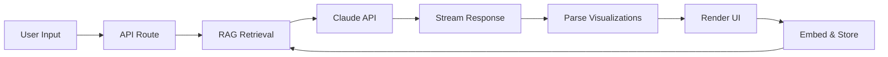

# TermAI Explorer — Design Specification

## Product Vision

TermAI Explorer is a **modern AI-native terminal interface** that reimagines the command line for the age of intelligent assistants. It combines the power and efficiency of CLI workflows with the intelligence of Claude AI, wrapped in a contemporary, macOS-inspired design system.

**Target Users**: Developers, data scientists, AI researchers, and power users who live in the terminal but want modern AI capabilities without leaving their workflow.

**Core Value Proposition**:
- **Seamless AI Integration**: Chat with Claude directly in your terminal
- **Persistent Knowledge**: RAG-powered conversation history that builds context over time
- **Native Visualizations**: Charts, tables, and data render inline without breaking flow
- **Modern UX**: Smooth animations, keyboard-first navigation, dark/light modes
- **Privacy-First**: Local-first storage with optional cloud sync
## Architecture Overview

```
┌─────────────────────────────────────────────────────────────┐
│                     TermAI Explorer                         │
├─────────────────────────────────────────────────────────────┤
│  Frontend Layer          │  Backend Layer                   │
│  ──────────────          │  ─────────────                   │
│  • Next.js 14 App Router │  • Next.js API Routes            │
│  • React Server Comp     │  • Claude API Integration        │
│  • Framer Motion         │  • Ollama (Local Embeddings)     │
│  • Tailwind CSS          │  • ChromaDB Vector Store         │
│  • TypeScript            │  • File System Storage           │
└─────────────────────────────────────────────────────────────┘
```

**Monorepo Structure**:
```
paper-trading/
├── webapp/                 # Next.js application
│   ├── app/               # App Router pages
│   ├── components/        # React components
│   ├── lib/               # Utilities, API clients
│   └── styles/            # Global styles, design tokens
├── filedb/                # Persistent data storage
│   ├── embeddings/        # Vector embeddings
│   ├── sessions/          # Conversation history
│   └── cache/             # Response cache
├── Makefile               # Dev orchestration
└── DESIGN.md              # This file
```

---

## Tech Stack (Modern)

### Frontend
- **Framework**: Next.js 14 (App Router, Server Components)
- **UI Library**: React 18 + Tailwind CSS v3
- **Animation**: Framer Motion (smooth, spring-based)
- **State**: Zustand (lightweight, TypeScript-first)
- **Forms**: React Hook Form + Zod validation
- **Icons**: Lucide React (consistent, tree-shakeable)

### Backend
- **API**: Next.js Route Handlers
- **AI SDK**: Anthropic Claude SDK (@anthropic-ai/sdk)
- **Vector DB**: ChromaDB (persistent, local-first)
- **Embeddings**: Ollama (nomic-embed-text model)
- **Storage**: JSON file system (./filedb/)

### Developer Experience
- **Language**: TypeScript 5.3+ (strict mode)
- **Linting**: ESLint + Prettier
- **Testing**: Vitest + Playwright
- **CLI**: Turbo (monorepo orchestration)
- **Versioning**: Changesets


## Core Features

### 1. AI Terminal Interface

**Modern Terminal Design**:
- Clean, distraction-free input area
- Monospace font (JetBrains Mono or SF Mono)
- Smooth scrolling with momentum
- Auto-expanding input field
- Command history navigation (↑/↓)
- Syntax highlighting for commands
- Multi-line support (Shift+Enter)

**Session Management**:
- Auto-generated session IDs (UUID)
- Persistent storage in localStorage + filedb
- Session sidebar with search/filter
- Export/import sessions as JSON
- Session branching (fork conversations)

### 2. Intelligent Context (RAG)

**Retrieval-Augmented Generation**:
- Automatic embedding of Q&A pairs
- Semantic search over conversation history
- Context window: Last 20 messages + top 5 relevant snippets
- Hybrid search: Dense (embeddings) + Sparse (keywords)
- Relevance scoring with configurable threshold

**Knowledge Organization**:
- Auto-tagging (topics: coding, data, analysis, etc.)
- Session summaries (generated by Claude)
- Related sessions discovery
- Quick reference cards for repeated queries

### 3. Native Visualizations

**Inline Rendering**:
Claude outputs special markup that renders as interactive visualizations:

```
<<chart:line
  data: {x: [1,2,3,4], y: [10,25,15,30]}
  title: "Revenue Growth"
  color: "blue"
>>
```

**Supported Types**:
- **Charts**: Line, bar, scatter, area (Recharts)
- **Tables**: Sortable, filterable, exportable (TanStack Table)
- **Code**: Syntax-highlighted with copy button (Shiki)
- **Metrics**: Stat cards, sparklines, progress bars
- **Rich**: Markdown, HTML, iframes (sanitized)

**Visualization Features**:
- Responsive sizing (mobile to ultrawide)
- Dark/light mode auto-adapt
- Interactive tooltips
- Export as PNG/SVG
- Animation on reveal

### 4. Command Palette (Cmd+K)

Quick actions without mouse:
- Create new session
- Search history
- Switch sessions
- Export data
- Toggle settings
- Run predefined commands

### 5. Keyboard Shortcuts

| Shortcut | Action |
|----------|--------|
| `Cmd/Ctrl + K` | Command palette |
| `Cmd/Ctrl + I` | Focus input |
| `Cmd/Ctrl + L` | Clear screen |
| `Cmd/Ctrl + N` | New session |
| `Cmd/Ctrl + S` | Save session |
| `Cmd/Ctrl + /` | Show shortcuts |
| `↑ / ↓` | Navigate history |
| `Ctrl + C` | Cancel generation |
| `Shift + Enter` | New line |

---

## Data Flow



**Sequence**:
1. User types command/query
2. Frontend sends to API route with session ID
3. Server retrieves relevant context from ChromaDB
4. Sends prompt + context to Claude API
5. Streams response to client
6. Frontend parses and renders visualizations
7. Embeds exchange and stores in vector DB

---

## Development Workflow

### Makefile Commands

```makefile
.PHONY: dev build test lint clean

# Start development environment
dev:
	@echo "🚀 Starting TermAI Explorer..."
	@mkdir -p filedb/{embeddings,sessions,cache}
	@cd webapp && npm run dev

# Build for production
build:
	@echo "📦 Building for production..."
	@cd webapp && npm run build

# Run tests
test:
	@echo "🧪 Running tests..."
	@cd webapp && npm run test

# Lint code
lint:
	@echo "🔍 Linting..."
	@cd webapp && npm run lint

# Clean artifacts
clean:
	@echo "🧹 Cleaning..."
	@rm -rf webapp/.next webapp/node_modules
	@rm -rf filedb/cache

# Start Ollama (for embeddings)
ollama:
	@echo "🦙 Starting Ollama..."
	@ollama serve

# Install dependencies
install:
	@echo "📚 Installing dependencies..."
	@cd webapp && npm install
```

### Environment Variables

```bash
# .env.local
ANTHROPIC_API_KEY=sk-ant-xxx
NEXT_PUBLIC_APP_URL=http://localhost:3000
OLLAMA_BASE_URL=http://localhost:11434
CHROMADB_PATH=./filedb/embeddings
```

---

## Roadmap

### Phase 1: MVP ✅
- [x] Basic terminal interface
- [x] Claude integration with streaming
- [x] Session persistence (JSON)
- [x] 3 core visualizations (chart, table, code)
- [x] Dark mode only

### Phase 2: Enhanced 🚧
- [ ] RAG with ChromaDB + Ollama embeddings
- [ ] Light/dark mode toggle
- [ ] Session management UI
- [ ] Command palette
- [ ] Export sessions (Markdown, JSON)

### Phase 3: Advanced 🔮
- [ ] Multi-model support (GPT-4, Claude 3.5)
- [ ] Voice input (Web Speech API)
- [ ] Session sharing (public/private links)
- [ ] Collaboration (real-time multi-user)
- [ ] Plugin system (custom visualizations)
- [ ] Mobile apps (React Native)

### Phase 4: Platform 🌟
- [ ] Cloud sync (optional)
- [ ] Team workspaces
- [ ] API access (webhooks)
- [ ] Analytics dashboard
- [ ] Custom themes
- [ ] Self-hosted option

---

# Frontend Design System

## Design Philosophy: Modern Clarity

**Aesthetic Direction**: Clean, minimalist, and purposeful. Think macOS Terminal meets Raycast meets Linear. No nostalgia, no CRT effects—just pure, functional beauty designed for 2024 and beyond.

**Core Principles**:
1. **Content First**: UI recedes, your conversation takes center stage
2. **Smooth Motion**: Spring-based animations that feel natural, not mechanical
3. **Adaptive Elegance**: Seamless light/dark mode with refined transitions
4. **Touch Friendly**: 44px tap targets, swipe gestures, haptic feedback
5. **Keyboard Native**: Every action accessible without leaving the keyboard

**Inspiration**: Apple Human Interface Guidelines, Raycast, Warp.dev, Linear, VS Code

---

## Design Tokens

### Color System (Neutral + Accent)

```css
:root {
  /* Neutral Grays (Light Mode) */
  --gray-50: #fafafa;
  --gray-100: #f5f5f5;
  --gray-200: #e5e5e5;
  --gray-300: #d4d4d4;
  --gray-400: #a3a3a3;
  --gray-500: #737373;
  --gray-600: #525252;
  --gray-700: #404040;
  --gray-800: #262626;
  --gray-900: #171717;
  --gray-950: #0a0a0a;

  /* Semantic Colors */
  --primary: #0066ff;        /* Blue for primary actions */
  --primary-hover: #0052cc;
  --success: #00a400;        /* Green */
  --warning: #ff9500;        /* Orange */
  --error: #ff3b30;          /* Red */
  --info: #5ac8fa;           /* Light blue */

  /* AI-Specific Colors */
  --ai-gradient-start: #0066ff;
  --ai-gradient-end: #5865f2;
  --ai-accent: #a78bfa;      /* Purple for AI responses */

  /* Data Visualization */
  --viz-blue: #0066ff;
  --viz-purple: #8b5cf6;
  --viz-pink: #ec4899;
  --viz-orange: #f97316;
  --viz-green: #10b981;
  --viz-teal: #14b8a6;

  /* Opacity Variants */
  --opacity-subtle: 0.03;
  --opacity-hover: 0.06;
  --opacity-active: 0.1;
  --opacity-disabled: 0.4;
}

[data-theme="dark"] {
  --gray-50: #0a0a0a;
  --gray-100: #171717;
  --gray-200: #262626;
  --gray-300: #404040;
  --gray-400: #525252;
  --gray-500: #737373;
  --gray-600: #a3a3a3;
  --gray-700: #d4d4d4;
  --gray-800: #e5e5e5;
  --gray-900: #f5f5f5;
  --gray-950: #fafafa;

  /* Adjusted for dark mode */
  --primary: #3395ff;
  --primary-hover: #66b3ff;
}
```

### Typography System

```css
@import url('https://fonts.googleapis.com/css2?family=JetBrains+Mono:wght@400;500;600&family=Inter:wght@400;500;600;700&display=swap');

:root {
  /* Font Families */
  --font-mono: 'JetBrains Mono', 'SF Mono', 'Consolas', monospace;
  --font-sans: 'Inter', -apple-system, BlinkMacSystemFont, sans-serif;

  /* Type Scale (Major Third: 1.250) */
  --text-xs: 0.75rem;      /* 12px - Labels, timestamps */
  --text-sm: 0.875rem;     /* 14px - Secondary text */
  --text-base: 1rem;       /* 16px - Body, terminal output */
  --text-md: 1.125rem;     /* 18px - User input */
  --text-lg: 1.25rem;      /* 20px - Headers */
  --text-xl: 1.5rem;       /* 24px - Section titles */
  --text-2xl: 1.875rem;    /* 30px - Page headers */
  --text-3xl: 2.25rem;     /* 36px - Hero */

  /* Line Heights */
  --leading-tight: 1.25;
  --leading-normal: 1.5;
  --leading-relaxed: 1.75;

  /* Font Weights */
  --font-normal: 400;
  --font-medium: 500;
  --font-semibold: 600;
  --font-bold: 700;

  /* Letter Spacing */
  --tracking-tight: -0.025em;
  --tracking-normal: 0;
  --tracking-wide: 0.025em;
}
```

### Spacing Scale

```css
:root {
  /* Base unit: 4px (Tailwind-compatible) */
  --space-0: 0;
  --space-px: 1px;
  --space-0_5: 0.125rem;  /* 2px */
  --space-1: 0.25rem;     /* 4px */
  --space-1_5: 0.375rem;  /* 6px */
  --space-2: 0.5rem;      /* 8px */
  --space-2_5: 0.625rem;  /* 10px */
  --space-3: 0.75rem;     /* 12px */
  --space-3_5: 0.875rem;  /* 14px */
  --space-4: 1rem;        /* 16px */
  --space-5: 1.25rem;     /* 20px */
  --space-6: 1.5rem;      /* 24px */
  --space-7: 1.75rem;     /* 28px */
  --space-8: 2rem;        /* 32px */
  --space-9: 2.25rem;     /* 36px */
  --space-10: 2.5rem;     /* 40px */
  --space-12: 3rem;       /* 48px */
  --space-16: 4rem;       /* 64px */
  --space-20: 5rem;       /* 80px */
  --space-24: 6rem;       /* 96px */
}
```

### Radius System

```css
:root {
  --radius-none: 0;
  --radius-sm: 0.25rem;    /* 4px - Small elements */
  --radius-md: 0.375rem;   /* 6px - Buttons, inputs */
  --radius-lg: 0.5rem;     /* 8px - Cards, panels */
  --radius-xl: 0.75rem;    /* 12px - Modals */
  --radius-2xl: 1rem;      /* 16px - Hero sections */
  --radius-full: 9999px;   /* Pill shapes */
}
```

### Shadow System

```css
:root {
  /* Elevation-based shadows */
  --shadow-xs: 0 1px 2px rgba(0, 0, 0, 0.05);
  --shadow-sm: 0 1px 3px rgba(0, 0, 0, 0.07), 0 1px 2px rgba(0, 0, 0, 0.04);
  --shadow-md: 0 4px 6px -1px rgba(0, 0, 0, 0.08), 0 2px 4px -1px rgba(0, 0, 0, 0.04);
  --shadow-lg: 0 10px 15px -3px rgba(0, 0, 0, 0.08), 0 4px 6px -2px rgba(0, 0, 0, 0.04);
  --shadow-xl: 0 20px 25px -5px rgba(0, 0, 0, 0.08), 0 10px 10px -5px rgba(0, 0, 0, 0.03);

  /* Inner glow for focus states */
  --glow-sm: 0 0 0 1px rgba(0, 102, 255, 0.1);
  --glow-md: 0 0 0 3px rgba(0, 102, 255, 0.15);
  --glow-lg: 0 0 0 5px rgba(0, 102, 255, 0.2);
}
```

### Animation Tokens

```css
:root {
  /* Spring-based easing (Framer Motion defaults) */
  --ease-spring: cubic-bezier(0.34, 1.56, 0.64, 1);
  --ease-smooth: cubic-bezier(0.4, 0, 0.2, 1);
  --ease-in: cubic-bezier(0.4, 0, 1, 1);
  --ease-out: cubic-bezier(0, 0, 0.2, 1);
  --ease-in-out: cubic-bezier(0.4, 0, 0.6, 1);

  /* Durations */
  --duration-instant: 100ms;
  --duration-fast: 150ms;
  --duration-normal: 200ms;
  --duration-slow: 300ms;
  --duration-slower: 500ms;

  /* Stagger delays for sequential animations */
  --delay-short: 50ms;
  --delay-normal: 100ms;
  --delay-long: 150ms;
}
```

---

## Component Specifications

### Layout Structure

```
┌─────────────────────────────────────────────────────────────┐
│  Header (60px)                          [Theme] [Settings] │
├──────────┬──────────────────────────────────────────────────┤
│          │                                                   │
│ Sidebar  │  Main Content Area                               │
│ (240px)  │  ┌───────────────────────────────────────────┐  │
│          │  │  Messages Container (flex-1, scrollable)  │  │
│ Session  │  │  - User message                            │  │
│ History  │  │  - AI response + visualizations           │  │
│          │  │  - User message                            │  │
│          │  └───────────────────────────────────────────┘  │
│          │                                                   │
│          │  ┌───────────────────────────────────────────┐  │
│          │  │  Input Area (80px, fixed at bottom)       │  │
│          │  │  [Prompt] [Input field]                  │  │
│          │  └───────────────────────────────────────────┘  │
└──────────┴──────────────────────────────────────────────────┘
```

### Header Component

**Props**: `interface HeaderProps { title?: string; actions?: ReactNode; }`

**Design**:
- Height: `60px`
- Background: `var(--gray-50)` with subtle bottom border
- Padding: `0 var(--space-6)`
- Display: flex, space-between, items-center

**Elements**:
- **Logo/Title**: Left-aligned, `var(--text-lg)`, `var(--font-semibold)`
- **Actions**: Right-aligned button group
  - Theme toggle (sun/moon icon)
  - Settings (gear icon)
  - New session (plus icon)
- **Border**: Bottom: `1px solid var(--gray-200)` (light) / `var(--gray-800)` (dark)

**Animations**:
- Hover: Subtle background change (`var(--opacity-hover)`)
- Click: Scale down to `0.97` (100ms)
- Theme toggle: Rotate icon during transition (300ms)

---

### Sidebar (Session List)

**Props**: `interface SidebarProps { sessions: Session[]; activeId: string; onSelect: (id: string) => void; }`

**Design**:
- Width: `240px` (desktop), `300px` (expanded)
- Background: `var(--gray-100)` (light) / `var(--gray-900)` (dark)
- Border-right: `1px solid var(--gray-200)` / `var(--gray-800)`
- Overflow-y: auto with custom scrollbar

**Session Item**:
- Padding: `var(--space-3) var(--space-4)`
- Margin: `var(--space-1) 0`
- Border-radius: `var(--radius-md)`
- Cursor: pointer
- Hover: Background `var(--gray-200)` / `var(--gray-800)`
- Active: Background `var(--primary)` with white text

**Session Item Structure**:
```
┌────────────────────────────────┐
│ 📄 Data Analysis Pipeline      │ Title (truncate, 1 line)
│ Transform sales data           │ Preview (gray-500, truncate)
│ 2 hours ago                    │ Timestamp (text-xs, muted)
└────────────────────────────────┘
```

**Search**:
- Input at top: `var(--space-3)` padding
- Background: `var(--gray-200)` / `var(--gray-800)`
- Border-radius: `var(--radius-md)`
- Icon: Magnifying glass (left, `var(--space-3)`)

---

### Messages Container

**Props**: `interface MessagesContainerProps { messages: Message[]; streaming?: boolean; }`

**Design**:
- Flex-1 (fills available space)
- Overflow-y: auto (smooth scroll behavior)
- Padding: `var(--space-6)`
- Scroll-to-bottom button (when scrolled up)

**Message Spacing**:
- Vertical gap: `var(--space-6)` between messages
- Within message: `var(--space-2)` between content blocks

**Scroll Behavior**:
- Auto-scroll on new message
- Smooth scroll on navigation
- Momentum scrolling (iOS)

---

### Message Component

**Props**:
```typescript
interface MessageProps {
  role: 'user' | 'assistant' | 'system';
  content: string;
  timestamp: Date;
  visualizations?: VisualizationData[];
}
```

**Design Variants**:

**User Message**:
- Alignment: Right-aligned (max-width: 80%)
- Background: `var(--primary)` (gradient: start → end)
- Color: White text
- Padding: `var(--space-3) var(--space-4)`
- Border-radius: `var(--radius-lg)` (bottom-right: `var(--radius-sm)`)
- Shadow: `var(--shadow-sm)`
- Animation: Slide in from right (200ms, ease-out)

**Assistant Message**:
- Alignment: Left-aligned (max-width: 90%)
- Background: Transparent
- Border-left: `3px solid var(--ai-accent)`
- Padding-left: `var(--space-3)`
- Animation: Fade in + slide up (200ms, stagger for content blocks)

**System Message**:
- Alignment: Center
- Background: `var(--gray-100)` / `var(--gray-900)`
- Padding: `var(--space-2) var(--space-4)`
- Border-radius: `var(--radius-full)`
- Font: `var(--text-sm)`, `var(--text-muted)`
- Icon prefix (ℹ️, ⚠️, ✅)

---

### Input Area

**Props**: `interface InputAreaProps { onSubmit: (text: string) => void; disabled?: boolean; placeholder?: string; }`

**Design**:
- Height: `80px` (fixed at bottom)
- Background: `var(--gray-50)` / `var(--gray-100)`
- Border-top: `1px solid var(--gray-200)` / `var(--gray-800)`
- Padding: `var(--space-4) var(--space-6)`
- Display: flex, gap: `var(--space-3)`, items-end

**Prompt**:
- Text: `user@ai` in `var(--ai-accent)`
- Font: `var(--font-mono)`, `var(--text-md)`
- Padding-right: `var(--space-2)`

**Input Field**:
- Flex-1
- Height: `auto` (min: `40px`, max: `120px`)
- Background: White / `var(--gray-200)`
- Border: `1px solid var(--gray-300)` / `var(--gray-700)`
- Border-radius: `var(--radius-lg)`
- Padding: `var(--space-3) var(--space-4)`
- Font: `var(--font-mono)`, `var(--text-base)`
- Resize: none
- Focus: Border `var(--primary)`, `var(--glow-md)`

**Submit Button**:
- Width: `40px`, height: `40px`
- Background: `var(--primary)`
- Border-radius: `var(--radius-md)`
- Icon: Arrow up (white)
- Hover: `var(--primary-hover)`
- Disabled: `var(--gray-400)`, no-hover

**Keyboard Hints**:
- `Enter`: Submit
- `Shift + Enter`: New line
- `Ctrl + L`: Clear input
- Show hints on hover (tooltip)

---

### Visualization Components

#### Base Visualization Panel

```typescript
interface VizPanelProps {
  type: 'chart' | 'table' | 'code' | 'metric';
  title?: string;
  children: ReactNode;
  defaultExpanded?: boolean;
  actions?: ReactNode;
}
```

**Design**:
- Background: White (light) / `var(--gray-200)` (dark)
- Border: `1px solid var(--gray-200)` / `var(--gray-700)`
- Border-radius: `var(--radius-lg)`
- Overflow: hidden
- Margin: `var(--space-3) 0`
- Box-shadow: `var(--shadow-sm)`

**Header**:
- Padding: `var(--space-3) var(--space-4)`
- Border-bottom: `1px solid var(--gray-200)` / `var(--gray-700)`
- Display: flex, justify-between, align-center
- Background: `var(--gray-50)` / `var(--gray-100)`

**Title**:
- Font: `var(--text-sm)`, `var(--font-semibold)`
- Color: `var(--gray-700)` / `var(--gray-300)`

**Expand/Collapse**:
- Icon: Chevron down (▼) / right (▶)
- Rotate: 0deg (collapsed) → 180deg (expanded)
- Duration: 200ms, ease-smooth

**Content**:
- Padding: `var(--space-4)`
- Animation: Height transition (200ms) + fade (200ms delay)

#### Chart Component (Recharts)

**Props**: `interface ChartProps { type: 'line' | 'bar' | 'area' | 'scatter'; data: ChartData; config?: ChartConfig; }`

**Design**:
- Height: `300px` (configurable)
- Colors: Data viz palette (blue, purple, pink, orange, green)
- Grid: Subtle (`var(--gray-200)` / `var(--gray-800)`, opacity: 0.5)
- Axis: `var(--gray-500)`, `var(--text-xs)`
- Tooltip: White bg, `var(--shadow-md)`, `var(--radius-md)`

**Animation**:
- Line: Draw from left (800ms, ease-smooth)
- Bar: Grow from bottom (500ms, stagger)
- Points: Fade in + scale (300ms)

#### Table Component (TanStack Table)

**Props**: `interface TableProps { columns: Column[]; data: RowData[]; sortable?: boolean; filterable?: boolean; }`

**Design**:
- Border: `1px solid var(--gray-200)` / `var(--gray-700)`
- Border-radius: `var(--radius-md)`
- Overflow: hidden

**Header**:
- Background: `var(--gray-100)` / `var(--gray-800)`
- Padding: `var(--space-3) var(--space-4)`
- Font: `var(--text-sm)`, `var(--font-semibold)`
- Border-bottom: `2px solid var(--gray-200)` / `var(--gray-700)`
- Sort icon: Arrow (↓/↑), color `var(--gray-400)`, active: `var(--primary)`

**Row**:
- Padding: `var(--space-3) var(--space-4)`
- Border-bottom: `1px solid var(--gray-100)` / `var(--gray-800)`
- Hover: Background `var(--gray-50)` / `var(--gray-900)`
- Font: `var(--text-sm)`

**Pagination**:
- Bottom padding: `var(--space-3)`
- Display: flex, justify-center, gap: `var(--space-2)`
- Button: `var(--radius-md)`, padding `var(--space-2) var(--space-3)`
- Active: Background `var(--primary)`, white text

#### Code Block Component (Shiki)

**Props**: `interface CodeBlockProps { language: string; code: string; showLineNumbers?: boolean; }`

**Design**:
- Background: `var(--gray-900)` (always dark for code)
- Border-radius: `var(--radius-md)`
- Padding: `var(--space-4)`
- Font: `var(--font-mono)`, `var(--text-sm)`
- Max-height: `400px`, overflow-y: auto

**Header**:
- Display: flex, justify-between, align-center
- Margin-bottom: `var(--space-3)`
- Language label: `var(--text-xs)`, uppercase, `var(--gray-500)`
- Copy button: Icon-only, hover: `var(--gray-700)` background

**Line Numbers**:
- Color: `var(--gray-600)`
- Padding-right: `var(--space-4)`
- Font: `var(--text-xs)`

---

### Command Palette (Cmd+K)

**Design**:
- Overlay: Fixed, inset 0, background `rgba(0, 0, 0, 0.4)` (backdrop-blur)
- Modal: Centered, max-width `560px`, width `90%`
- Background: White / `var(--gray-200)`
- Border-radius: `var(--radius-xl)`
- Shadow: `var(--shadow-xl)`
- Animation: Scale 0.95 → 1 + fade (200ms, spring)

**Input**:
- Padding: `var(--space-4) var(--space-6)`
- Font: `var(--text-lg)`, `var(--font-sans)`
- Border: none
- Border-bottom: `1px solid var(--gray-200)` / `var(--gray-700)`

**Results List**:
- Max-height: `400px`, overflow-y: auto
- Padding: `var(--space-2)`

**Result Item**:
- Padding: `var(--space-3) var(--space-4)`
- Border-radius: `var(--radius-md)`
- Display: flex, align-center, gap: `var(--space-3)`
- Hover: Background `var(--gray-100)` / `var(--gray-800)`
- Active: Background `var(--primary)`, white text

**Keyboard Shortcuts Display**:
- Right-aligned, `var(--text-xs)`, `var(--gray-500)`
- Mono font, padding `var(--space-1) var(--space-2)`
- Background: `var(--gray-100)` / `var(--gray-800)`
- Border-radius: `var(--radius-sm)`

---

## Responsive Design

### Breakpoints

```css
/* Mobile First Approach */
/* Default: < 640px (mobile) */

@media (min-width: 640px) {
  /* sm: Large phones, small tablets */
}

@media (min-width: 768px) {
  /* md: Tablets */
}

@media (min-width: 1024px) {
  /* lg: Laptops, desktops */
}

@media (min-width: 1280px) {
  /* xl: Large screens */
}

@media (min-width: 1536px) {
  /* 2xl: Ultrawide */
}
```

### Mobile (< 640px)

**Layout**:
- Sidebar: Hidden (hamburger menu to open drawer)
- Header: Simplified (logo + menu button)
- Messages: Full-width padding `var(--space-4)`
- Input: Full-width, padding `var(--space-4)`

**Typography**:
- Scale down by one step (base → 14px)
- Line height: `var(--leading-relaxed)`

**Touch Targets**:
- Min 44x44px (WCAG AAA)
- Spacing: `var(--space-4)` between interactive elements

**Gestures**:
- Swipe right: Open sidebar
- Swipe left: Close sidebar
- Pull down: Refresh session

**Virtual Keyboard**:
- Input maintains focus
- Auto-scroll to input on keyboard open
- Hide suggestions during input

### Tablet (640px - 1024px)

**Layout**:
- Sidebar: Collapsible (240px when open)
- Split view possible (session list + main)
- Max-width container: `900px`

**Typography**:
- Base: `var(--text-base)` (16px)

**Interactions**:
- Touch + keyboard hybrid
- Hover states work on touch

### Desktop (≥ 1024px)

**Layout**:
- Sidebar: Persistent (240px)
- Max-width container: `1200px` (centered)
- Multiple visualization columns possible

**Enhanced Features**:
- Command palette (Cmd+K)
- Keyboard shortcuts visible on hover
- Context menus (right-click)
- Drag-and-drop sessions
- Multi-select for batch operations

---

## Accessibility

### WCAG 2.1 AA Compliance

**Color Contrast**:
- Normal text: Minimum 4.5:1
- Large text (18px+): Minimum 3:1
- Interactive elements: Minimum 3:1

**Focus Indicators**:
- Width: 2px solid
- Color: `var(--primary)`
- Offset: 2px (total 4px from element)
- Always visible, not just on keyboard

**Keyboard Navigation**:
- Tab order: Logical, left-to-right, top-to-bottom
- Skip links: "Skip to main content"
- Focus trapping in modals
- Escape to close modals/dropdowns

**Screen Reader**:
- Semantic HTML (`main`, `nav`, `article`, `section`)
- ARIA labels for icons, buttons
- Live regions for streaming (`aria-live="polite"`)
- Announcements for state changes

**Motion**:
```css
@media (prefers-reduced-motion: reduce) {
  *,
  *::before,
  *::after {
    animation-duration: 0.01ms !important;
    transition-duration: 0.01ms !important;
  }
}
```

---

## Animation System

### Page Load (Initial)

```javascript
// Staggered fade-in sequence
1. Sidebar: slide in from left (300ms, delay 0ms)
2. Header: fade in (200ms, delay 100ms)
3. Messages: stagger children (200ms per item, delay 200ms)
4. Input: slide up (300ms, delay 400ms)
```

### Message Streaming

**Typewriter Effect**:
- Reveal character-by-character (10ms per char)
- Cursor: Blinking block at end
- Natural pauses (200ms) at commas, periods

**Code Blocks**:
- Syntax-highlighted lines appear sequentially
- Stagger: 50ms per line

**Visualizations**:
- Expand container (200ms)
- Fade in content (200ms delay)
- Animate charts/tables (500ms)

### Micro-interactions

| Element | Hover | Active/Click |
|---------|-------|--------------|
| Button | Scale 1.05, shadow-lg | Scale 0.95 |
| Input | Border color change | Glow effect |
| Session Item | Background + slide 2px right | Scale 0.98 |
| Viz Panel | Subtle lift (translateY -2px) | N/A |
| Table Row | Background change | N/A |

### Loading States

**Spinner**:
- SVG circle, rotating
- Size: 24px (default)
- Color: `var(--primary)`
- Animation: Linear, 1s duration

**Skeleton**:
- Gray background (`var(--gray-200)` / `var(--gray-800)`)
- Shimmer effect: Gradient slide (1.5s, infinite)
- Border-radius: Same as content

**Pulse** (for streaming indicator):
- Dot: 8px, `var(--primary)`
- Animation: Scale 1 → 1.5 → 1, opacity 0.5 → 1 → 0.5
- Duration: 1.5s

---

## Performance

### Code Splitting

```typescript
// Route-based splitting (Next.js App Router)
// Component-based splitting for visualizations

const Chart = dynamic(() => import('@/components/viz/Chart'), {
  loading: () => <Skeleton height={300} />,
  ssr: false,
});

const Table = dynamic(() => import('@/components/viz/Table'), {
  loading: () => <Skeleton height={200} />,
});
```

### Lazy Loading

- Session history: Virtual scrolling (render 50 items)
- Images: Intersection Observer (trigger 200px before viewport)
- Syntax highlighting: On-demand (when code block visible)

### Bundle Size Targets

- Initial JS: < 100kb (gzipped)
- First Contentful Paint: < 1.5s
- Time to Interactive: < 3s

---

## Implementation Checklist

### Foundation
- [ ] Design tokens (CSS variables)
- [ ] Base styles (reset, typography)
- [ ] Light/dark mode system
- [ ] Layout components (Header, Sidebar, Main)

### Core Features
- [ ] Message components (user, assistant, system)
- [ ] Input area with auto-resize
- [ ] Streaming animation
- [ ] Session management UI
- [ ] Command palette

### Visualizations
- [ ] Chart component (Recharts)
- [ ] Table component (TanStack Table)
- [ ] Code block component (Shiki)
- [ ] Metric/stat cards

### Polish
- [ ] Responsive breakpoints
- [ ] Keyboard shortcuts
- [ ] Accessibility audit
- [ ] Performance optimization
- [ ] Error boundaries

This modern design system prioritizes clarity, smoothness, and adaptability—creating a terminal experience that feels at home in 2024 while remaining true to the efficiency of command-line interfaces.

READ /Users/dev/Documents/projects/paper-trading/CLAUDE-HELP.md
READ ~/.claude/settings.json for API KEY
